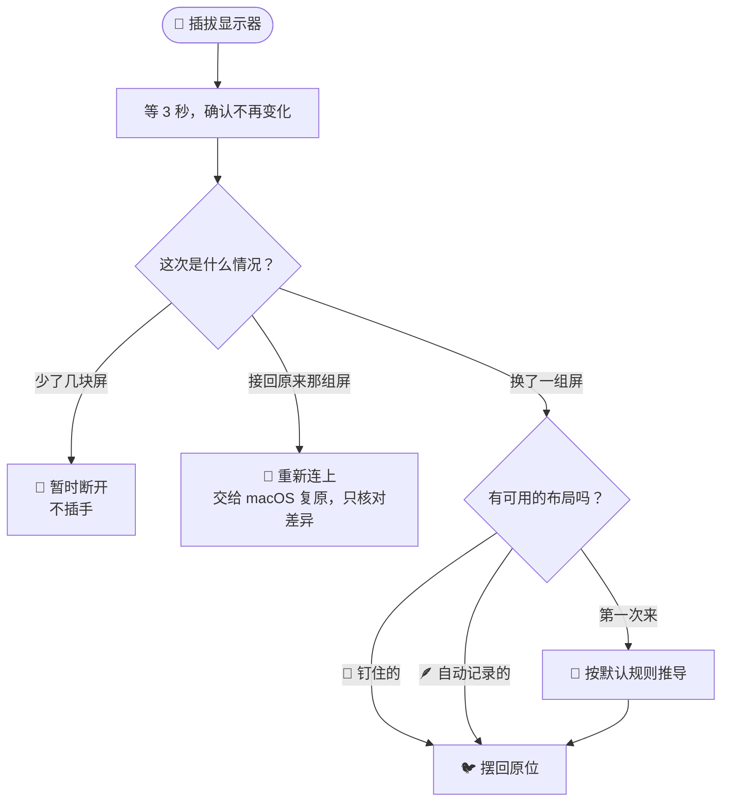
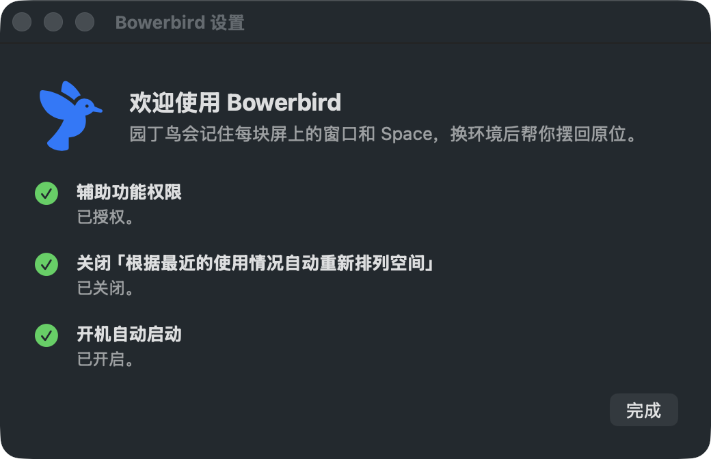

<div align="center">

# 🐦 Bowerbird · 园丁鸟

**你的窗口，各回各家。**

一只住在 macOS 菜单栏里的小鸟，记住每组显示器上的窗口、原生全屏和 Space 顺序，<br/>
你换个地方插上显示器，它就把一切摆回原位。


</div>

---

## 园丁鸟是谁？

澳大利亚有一种鸟叫**园丁鸟**（bowerbird）。雄鸟会搭一座小亭子，再把捡来的蓝色瓶盖、花瓣、贝壳按颜色和位置摆得一丝不苟。

科学家做过一个有点坏的实验：趁它不在，偷偷把其中一件挪个位置。

它回来之后，**立刻把那件东西放回原处**。

这个 App 做的就是同一件事，只不过它摆的是你的窗口。

## 你可能也经历过

早上到公司，笔记本接上两块外接屏：Claude 和 Notes 全屏放在大屏上，Chrome 全屏放在副屏上，终端和 ChatGPT 留在笔记本上。

晚上回家，换成一块外接屏。macOS 把所有东西一股脑塞到主屏，全屏应用顺序乱成一锅粥。

第二天回到公司，再来一遍。😮‍💨

**Bowerbird 让这件事只发生在第一次。**

## 它会做什么

| | |
|---|---|
| 🖥️ **认得出每个地方** | 按"接了哪几块显示器"识别家里、公司，不靠屏幕数量，也不怕你调整了屏幕排列 |
| 🪟 **窗口回到原位** | 显示器、位置、尺寸都恢复，包括藏在其它 Space 里、当前看不见的窗口 |
| 🎬 **原生全屏也能搬** | 全屏应用会回到正确的显示器，**连 Space 的先后顺序都排好** |
| 👀 **停在你离开时那一页** | 每块屏恢复后显示的正是你离开时看着的那个 Space，键盘焦点也还给原来的窗口 |
| 🪶 **不用手动保存** | 屏幕稳定时每分钟默默记一次布局；想固定某个布局，就"钉住"它 |
| 🧭 **第一次来也有主意** | 从三屏换到两屏，自动把两块外接屏的内容合到一块上；从两屏换到三屏，交给分辨率更高的那块 |
| 🤝 **该放手时放手** | 拔线再插回同一组屏时，macOS 自己会复原，Bowerbird 不插手 |
| ↩️ **后悔药** | 一键撤销上次恢复，全屏状态和 Space 顺序一起撤回 |

## 一图看懂：公司 ⇄ 家里

**🏢 公司（三屏）**

| 显示器 | ① | ② | ③ |
|---|---|---|---|
| 💻 内建屏 | 桌面 | Ghostty | ChatGPT |
| 🖥️ VP2770（2K） | 桌面 | Claude | Notes |
| 🖥️ VX3209（1080p） | Chrome | 桌面 | |

<p align="center">⬇️ &nbsp;拔掉两块，回家接上一块&nbsp; ⬇️</p>

**🏠 家里（两屏）**

| 显示器 | ① | ② | ③ | ④ |
|---|---|---|---|---|
| 💻 内建屏 | 桌面 | Ghostty | ChatGPT | |
| 🖥️ LG UltraFine | 桌面 | Claude | Notes | Chrome |

内建屏原封不动；两块外接屏合成一块，分辨率更高的 VP2770 排在前面，两个桌面上的窗口也合到同一个桌面里。

再回到公司时，Bowerbird 用它在公司记下的布局，把 Claude、Notes 送回 VP2770，Chrome 送回 VX3209。

## 它怎么决定要不要动手



## 安装

目前需要从源码构建（需要 Xcode 及 Swift 6 工具链）：

```bash
git clone https://github.com/crazynomad/bowerbird.git
cd bowerbird
./scripts/build-app.sh --install   # 构建 → 签名 → 安装到「应用程序」→ 启动
```

> [!NOTE]
> 脚本默认用钥匙串里的 `Apple Development` 证书签名。macOS 是按签名记住辅助功能权限的，固定签名能保证每次重新构建后不用重新授权。没有开发者证书的话，可以用 `CODESIGN_IDENTITY=- ./scripts/build-app.sh --install` 临时签名，代价是每次重新构建后都要重新授权一次。

## 第一次打开

Bowerbird 会弹出一个设置窗口，逐项检查，每项都能一键处理：

<p align="center"></p>

| 检查项 | 为什么 |
|---|---|
| **辅助功能权限**（必需） | 读取和移动窗口全靠它。在系统设置里打勾后，窗口里会自动变成 ✅ |
| **关闭"根据最近的使用情况自动重新排列空间"**（推荐） | 开着它，macOS 会按你的使用习惯偷偷调换 Space，恢复好的顺序保持不住 |
| **开机自动启动**（推荐） | 不然重启电脑后，小鸟就不在岗了 |

之后它就安静地待在菜单栏里了。🐦

## 日常使用

基本什么都不用做：插上显示器，等几秒，看着全屏窗口自己排好队。恢复进行中，菜单栏的小鸟会一闪一闪；鼠标悬停可以看到它正在做哪一步。

点开菜单还能：

- **恢复布局**：手动把当前环境摆回原样
- **撤销上次恢复**：不满意就退回去
- **钉住当前布局…**：把现在这套当成标准答案，不会被自动记录覆盖
- **显示器变化时自动恢复 / 开机自动启动**：两个开关
- **查看日志**：每次恢复移动了什么、为什么，都记在这里

## 常见问题

<details>
<summary><b>为什么不上 Mac App Store？</b></summary>

macOS 没有公开接口可以读取 Space 的顺序，也没法拿到其它 Space 上的窗口。Bowerbird 用了一些私有接口（和 yabai、AltTab 等工具的路子一样），这类 App 过不了 App Store 审核，只能从源码安装。

</details>

<details>
<summary><b>为什么有的全屏应用排不到普通桌面前面？</b></summary>

macOS 不让程序直接调整 Space 的顺序。Bowerbird 用的办法是：新开的全屏 Space 总会插在"当前显示的 Space"紧后面，所以先切到前一个邻居，再让窗口进入全屏。普通桌面本身挪不动，桌面前面又没有邻居可借时，全屏应用只能排在桌面后面。Bowerbird 会认出这种情况，不会反复折腾。

</details>

<details>
<summary><b>拔线之后，它为什么什么都不做？</b></summary>

这是故意的。拔掉显示器、再插回同一组时，macOS 会按显示器记住的信息自己复原。如果 Bowerbird 在中间插手（尤其是重建全屏 Space），插回时 macOS 反而认不出来了。所以它只在你真的换了一组显示器时才出手。

</details>

<details>
<summary><b>恢复要多久？</b></summary>

普通窗口几乎是瞬间完成。每个需要重新排位的全屏应用大约 6 秒，因为要等 macOS 的全屏动画播完。Bowerbird 只动必须动的那几个，已经在正确位置的不会碰。

</details>

<details>
<summary><b>最小化的窗口呢？</b></summary>

不管。最小化的窗口不会被记录，也不会被恢复。

</details>

## 隐私

Bowerbird **完全在本地运行，不联网**。它只会写两处文件：

- 布局：`~/Library/Application Support/Bowerbird/Layouts/`（JSON，可以直接打开看）
- 日志：`~/Library/Logs/Bowerbird.log`

## 已知限制

- 每块显示器只支持一个普通桌面
- 分屏（Split View）的全屏 Space 暂不支持
- 合盖只用外接屏、重启电脑后的窗口配对等场景，还在实测中

---

## 给开发者

<details>
<summary><b>项目结构</b></summary>

| 模块 | 职责 |
|---|---|
| `BowerbirdCore/Private.swift` | 所有私有接口都集中在这里（SkyLight、AX 远程令牌）。macOS 升级后出问题，先看这里 |
| `WindowCatalog` | 枚举所有 Space 上的真实窗口 |
| `WindowMatcher` | 三轮配对：窗口 ID → 标题 → 创建顺序（只用于重启过的应用） |
| `SpacePlanner` | 保留已对上的部分，只重排之后的全屏窗口（纯函数） |
| `LayoutMapper` | 首次进入某个环境时的默认推导规则（纯函数） |
| `TransitionTracker` | 区分"暂时断开 / 重新连上 / 换环境"（纯函数） |
| `Restorer` | 恢复引擎：退出全屏 → 摆放窗口 → 按序重新全屏 → 切回前台页 |

设计过程、实测数据和踩过的坑，都记录在 [IDEAS.md](IDEAS.md)。

</details>

<details>
<summary><b>调试命令行</b></summary>

同一个可执行文件带子命令时就是命令行工具（借用终端的辅助功能权限）：

```bash
swift build
.build/debug/Bowerbird dump                  # 列出环境和所有窗口
.build/debug/Bowerbird pin [名称]             # 钉住当前布局
.build/debug/Bowerbird learn                 # 写入一次自动记录
.build/debug/Bowerbird restore [布局.json]    # 恢复（默认：钉住 → 自动记录）
.build/debug/Bowerbird derive <布局.json>     # 按默认规则推导到当前环境，输出 JSON
.build/debug/Bowerbird diff [布局.json]       # 只读对比当前窗口与布局
swift test                                   # 单元测试
```

</details>

## 致谢

读取 Space 和枚举跨 Space 窗口的思路，参考了 [yabai](https://github.com/koekeishiya/yabai) 和 [AltTab](https://github.com/lwouis/alt-tab-macos) 社区多年摸索出的做法。

## 许可证

[MIT](LICENSE) © 2026 Burn Wang

<div align="center">
<sub>由 <a href="https://www.youtube.com/channel/UCJhUtNsR5pvU_gWWkxxUXUQ">绿皮火车</a> 与 Claude 一起搭的窝 🪺</sub>
</div>
